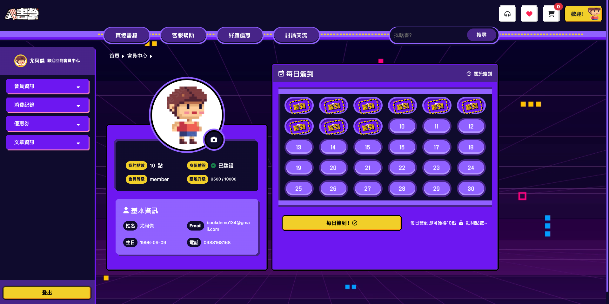

# bookcamp

書籍購物平台

專案技術
使用 Next.js (Pages Router) 開發
使用 Bootstrap 5 做網頁切版
使用 Axios 套件串接 API
使用 Node.js 串接 MySQL 資料庫
使用 Firebase 實作Google登入
使用 JWT 處理會員身份驗證
此專案我所負責的部分是會員系統的開發，專案發想以遊戲與點陣圖風格去做設計，並且以諧音輸贏為網站名稱，希望讓使用者在瀏覽網站時，是以輕鬆且帶有點好奇的心情去操作，就如同在玩遊戲一樣。

